# AWS Capstone – Highly Available 3-Tier Web Application

## 📌 Project Overview

This project demonstrates the deployment of a highly available, scalable, and secure 3-tier web application architecture on AWS. The infrastructure was designed using industry best practices, including public and private subnets, Application Load Balancer, Auto Scaling Group, Amazon RDS MySQL, NAT Gateway, IAM Roles, CloudWatch monitoring, and SNS notifications.

The application is hosted on Amazon EC2 instances running NGINX behind an Application Load Balancer, while the database resides securely in private subnets.

---

## 🏗️ Architecture

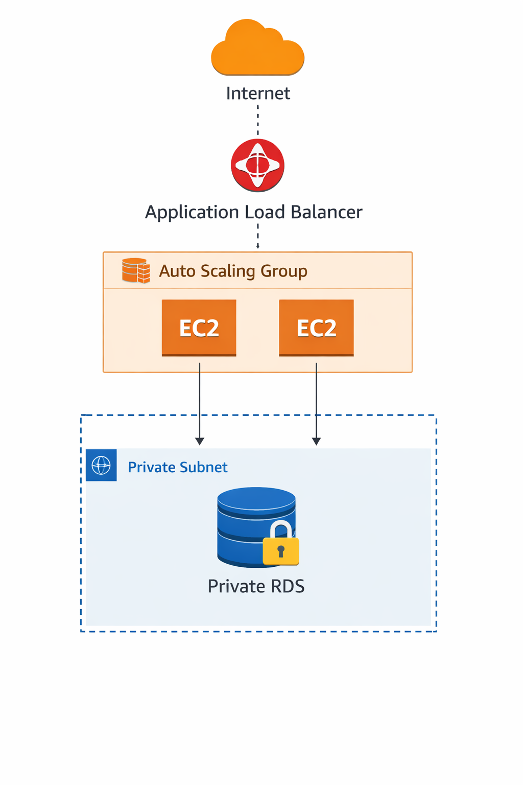

---

## 🛠️ AWS Services Used

- Amazon VPC
- Public & Private Subnets
- Internet Gateway
- NAT Gateway
- Route Tables
- Security Groups
- Elastic IP
- IAM Role
- EC2 Launch Template
- Auto Scaling Group
- Application Load Balancer (ALB)
- Target Group
- Amazon EC2
- Amazon RDS (MySQL)
- Amazon CloudWatch
- Amazon SNS

---

## 📂 Project Architecture

```
                    Internet
                        │
            Application Load Balancer
                        │
             Auto Scaling Group (ASG)
              ┌────────────────────┐
              │                    │
         EC2 Instance         EC2 Instance
              │                    │
              └──────────┬─────────┘
                         │
                  Amazon RDS MySQL
                  (Private Subnets)
```

---

# Implementation Steps

## Step 1 – Create VPC

- Created a custom VPC
- CIDR Block: 10.0.0.0/16

### Screenshot

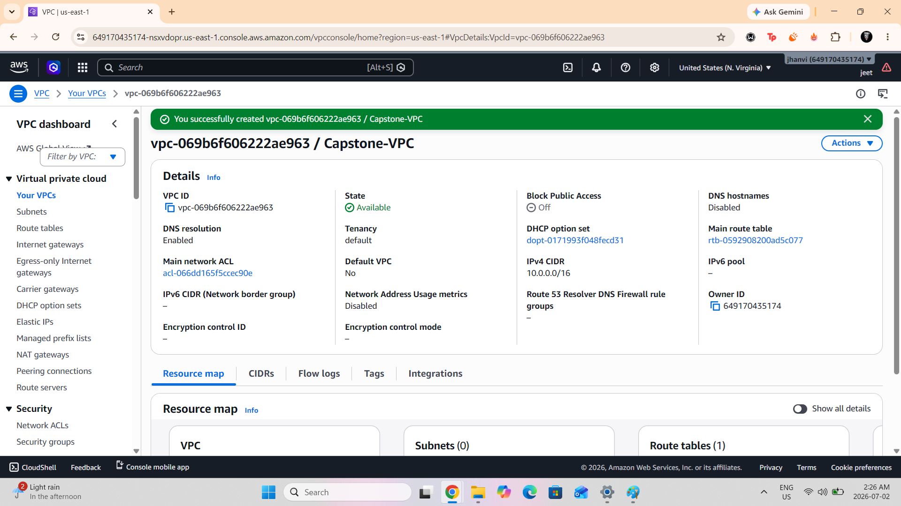

---

## Step 2 – Create Public & Private Subnets

Created:

- Public-Subnet-1
- Public-Subnet-2
- Private-Subnet-1
- Private-Subnet-2

Enabled Auto Assign Public IP on public subnets.

### Screenshots

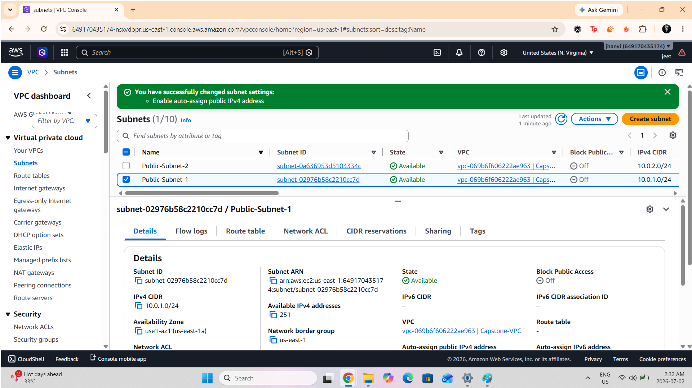

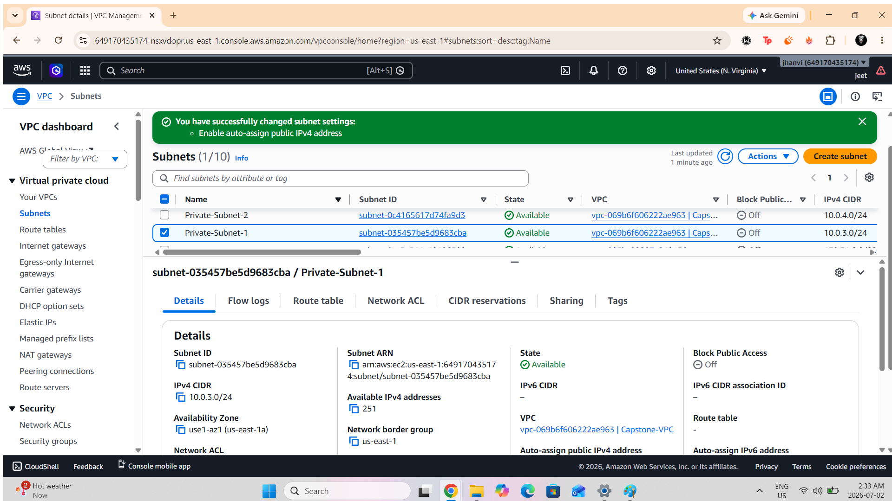

---

## Step 3 – Internet Gateway

Created and attached an Internet Gateway to the VPC.

### Screenshot

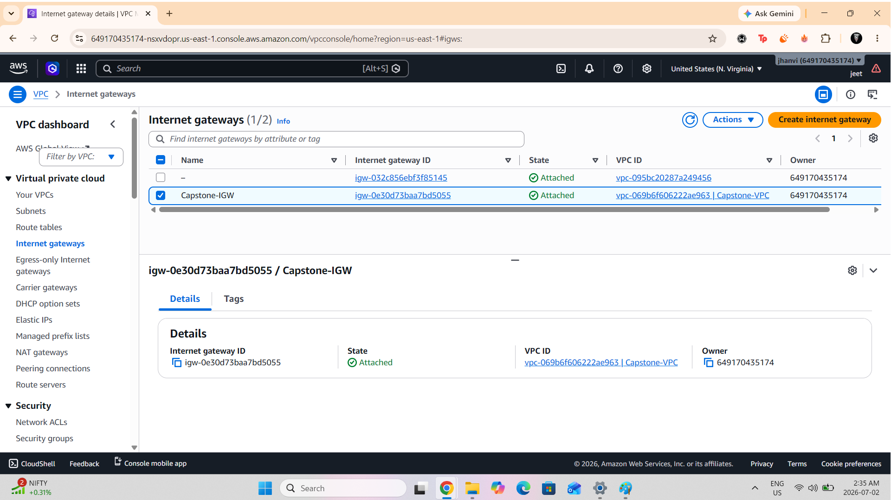

---

## Step 4 – Configure Route Tables

Created:

- Public Route Table
- Private Route Table

Configured:

- Public route → Internet Gateway
- Private route → NAT Gateway

### Screenshots

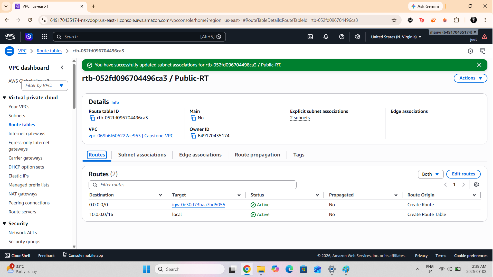

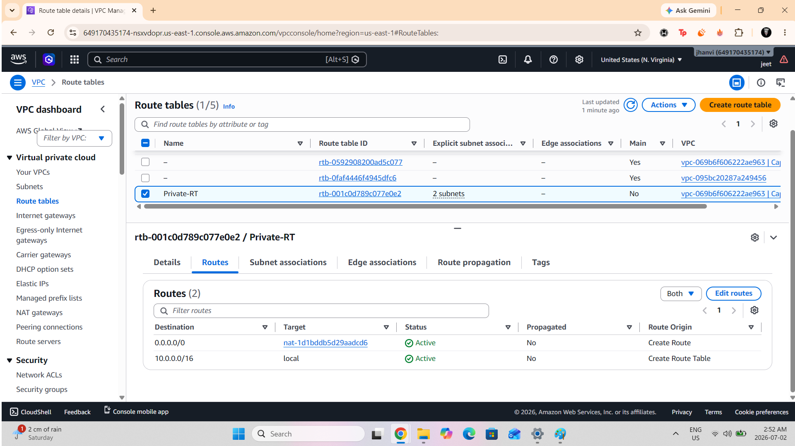

---

## Step 5 – NAT Gateway

Allocated an Elastic IP and deployed a NAT Gateway inside the public subnet for secure outbound internet access from private subnets.

### Screenshot

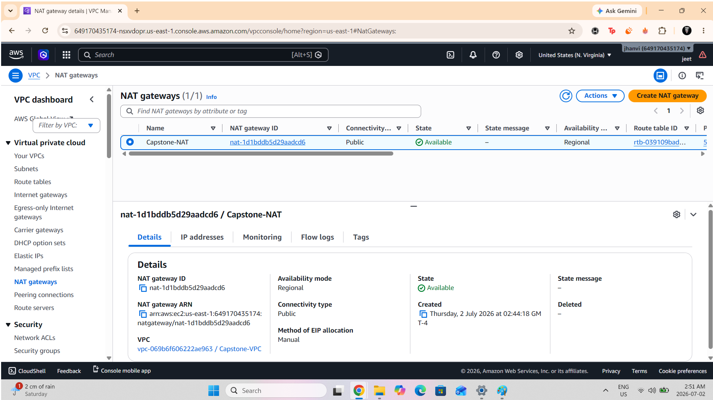

---

## Step 6 – Security Groups

Created three security groups:

- ALB-SG
- EC2-SG
- RDS-SG

Configured:

- HTTP access through ALB
- SSH from My IP
- MySQL access only from EC2

### Screenshot

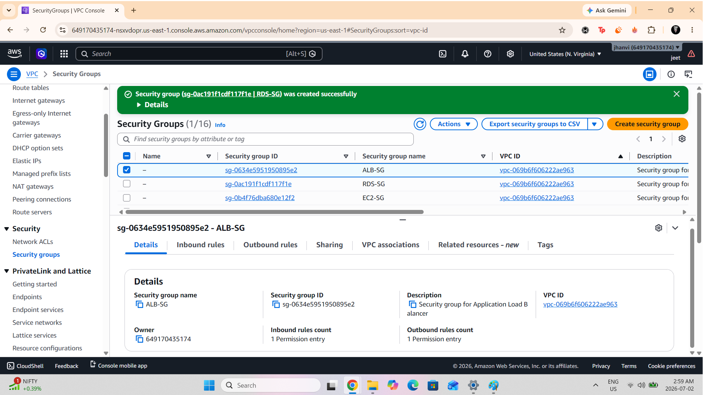

---

## Step 7 – IAM Role

Created an EC2 IAM Role with:

- AmazonSSMManagedInstanceCore
- CloudWatchAgentServerPolicy

---

## Step 8 – Launch Template

Created Launch Template using:

- Amazon Linux 2023
- t2.micro
- IAM Role
- User Data Script
- EC2 Security Group

User Data automatically:

- Installs NGINX
- Starts NGINX
- Deploys a sample web page

### Screenshot

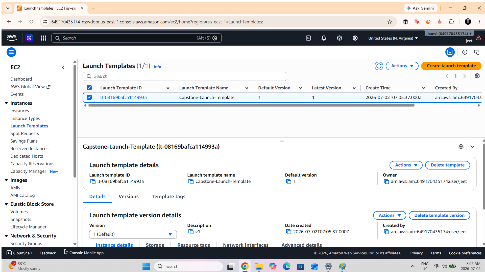

---

## Step 9 – Target Group

Created Target Group for HTTP traffic.

Configured health checks.

### Screenshot

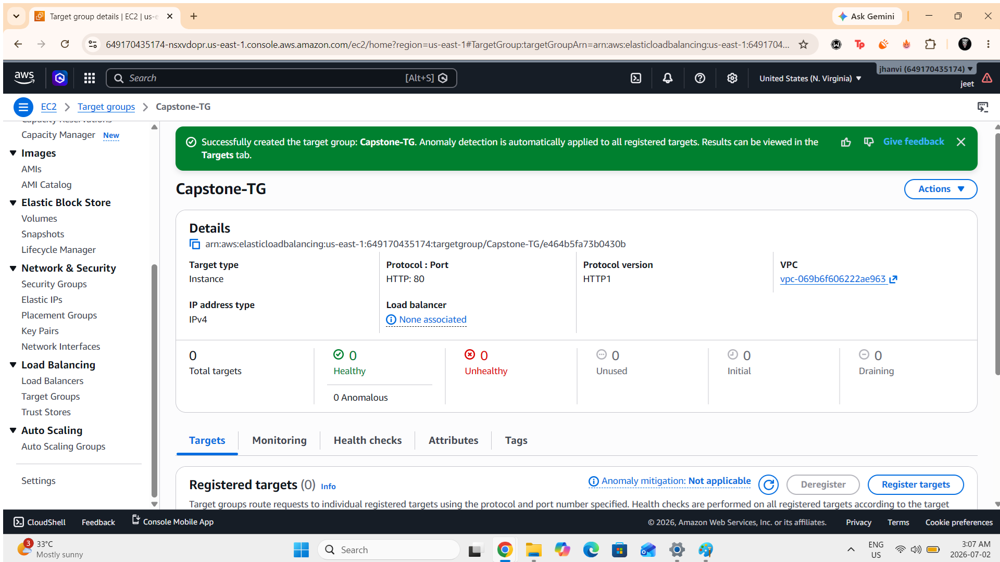

---

## Step 10 – Application Load Balancer

Created Internet-facing Application Load Balancer.

Configured:

- HTTP Listener
- Target Group Association
- Public Subnets

### Screenshot

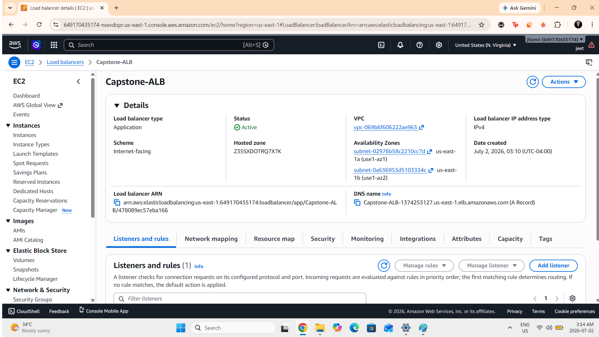

---

## Step 11 – Auto Scaling Group

Created Auto Scaling Group using the Launch Template.

Configuration:

- Desired Capacity: 2
- Minimum: 2
- Maximum: 4

Enabled ELB Health Checks.

### Screenshots

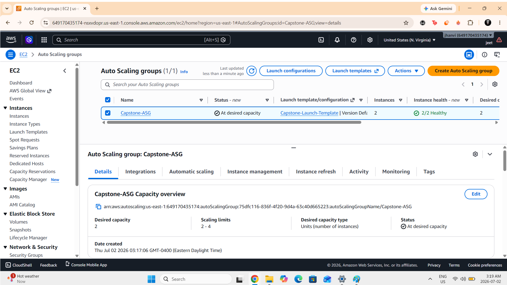

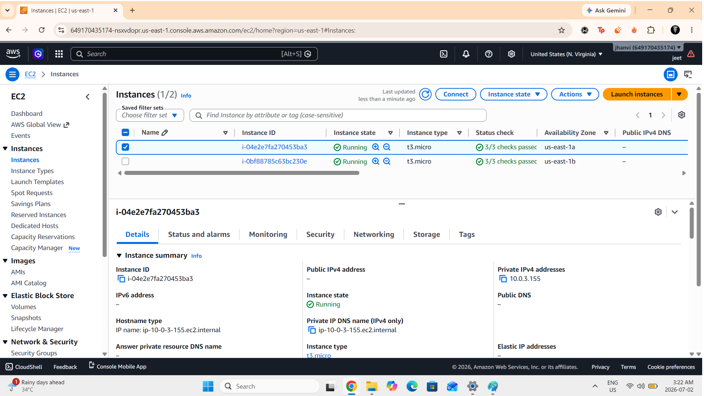

---

## Step 12 – Amazon RDS MySQL

Created a private Amazon RDS MySQL database.

Configuration:

- MySQL
- Private Subnets
- Public Access Disabled
- RDS Security Group

### Screenshot

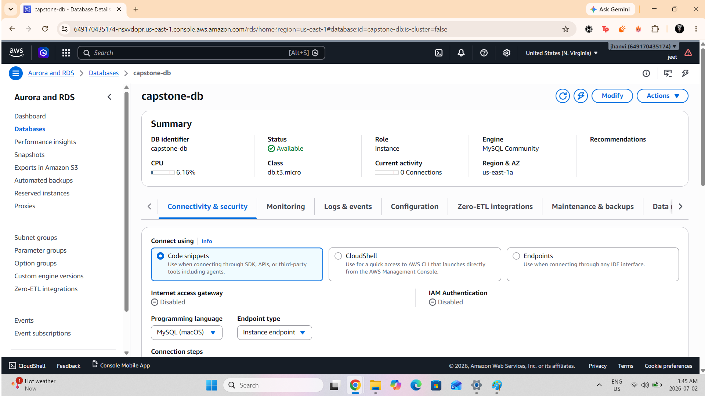

---

## Step 13 – Test Application

Verified successful deployment using the Application Load Balancer DNS endpoint.

### Screenshot

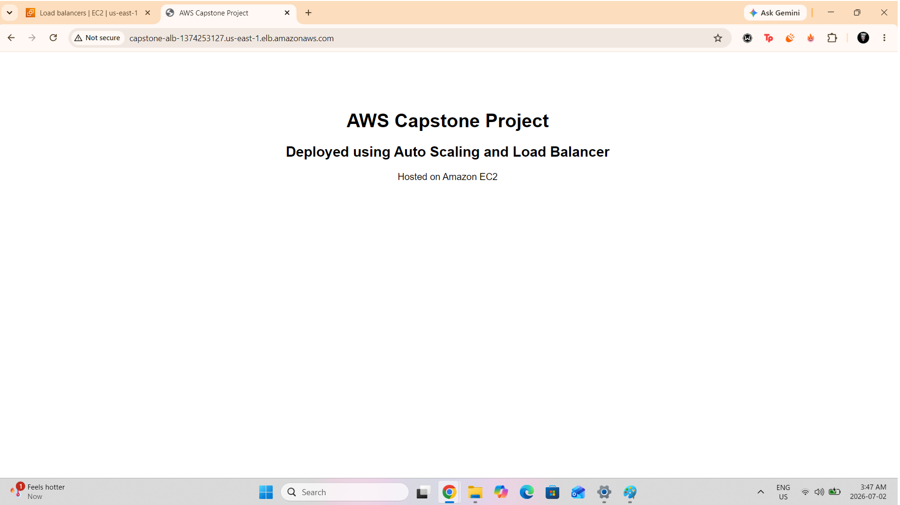

---

## Step 14 – CloudWatch Monitoring

Created CloudWatch Alarm for EC2 CPU Utilization.

Alarm Threshold:

- CPU > 70%

### Screenshot

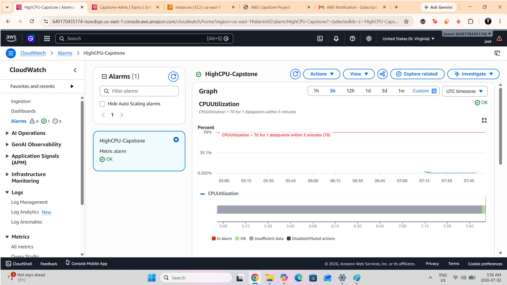

---

## Step 15 – SNS Notifications

Configured Amazon SNS email notifications for CloudWatch alarms.

### Screenshot

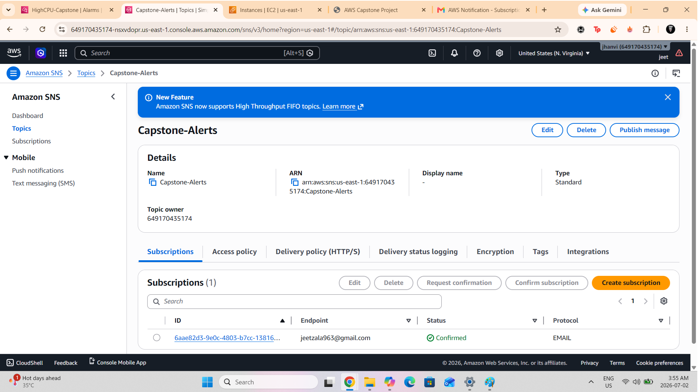

---

# Project Features

- Highly Available Architecture
- Public & Private Networking
- Internet-facing Load Balancer
- Auto Scaling
- Private Database
- Secure Security Groups
- IAM Best Practices
- Cloud Monitoring
- Email Notifications
- Infrastructure Isolation
- Production-style AWS Architecture

---

# Skills Demonstrated

- AWS Networking
- VPC Design
- Route Tables
- NAT Gateway
- Security Groups
- IAM
- EC2
- Launch Templates
- Auto Scaling
- Load Balancing
- Amazon RDS
- CloudWatch
- SNS
- High Availability
- Infrastructure Design
- Cloud Security

---

# Project Structure

```
AWS-Capstone-Project/
│
├── README.md
├── architecture.png
├── vpc-created.png
├── public-subnets-created.png
├── private-subnets-created.png
├── internet-gateway-attached.png
├── public-route-table.png
├── nat-gateway-created.png
├── private-route-table.png
├── security-groups-created.png
├── launch-template-created.png
├── target-group-created.png
├── load-balancer-created.png
├── auto-scaling-group-created.png
├── ec2-instances-running.png
├── rds-database-created.png
├── application-running.png
├── cloudwatch-alarm-created.png
└── sns-topic-created.png
```

---

# Cleanup

After completing the project, all AWS resources were deleted to avoid ongoing charges.

Resources removed:

- Auto Scaling Group
- EC2 Instances
- Application Load Balancer
- Target Group
- Launch Template
- Amazon RDS
- CloudWatch Alarm
- SNS Topic
- NAT Gateway
- Elastic IP
- Route Tables
- Internet Gateway
- Security Groups
- Subnets
- VPC

---

# Learning Outcomes

Through this project, I gained hands-on experience with:

- Designing Highly Available AWS Architectures
- Building Secure VPC Networks
- Configuring Public & Private Subnets
- Deploying Auto Scaling Infrastructure
- Implementing Load Balancing
- Managing Amazon RDS Databases
- Monitoring AWS Resources
- Creating CloudWatch Alarms
- Configuring SNS Notifications
- Applying AWS Security Best Practices

---

## 👨‍💻 Author

**Jeet Zala**

Aspiring Cloud & DevOps Engineer

GitHub: https://github.com/jeetzala
